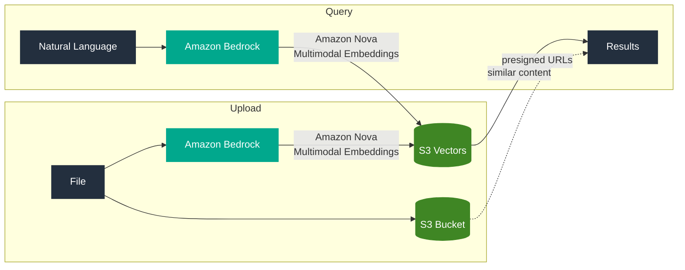
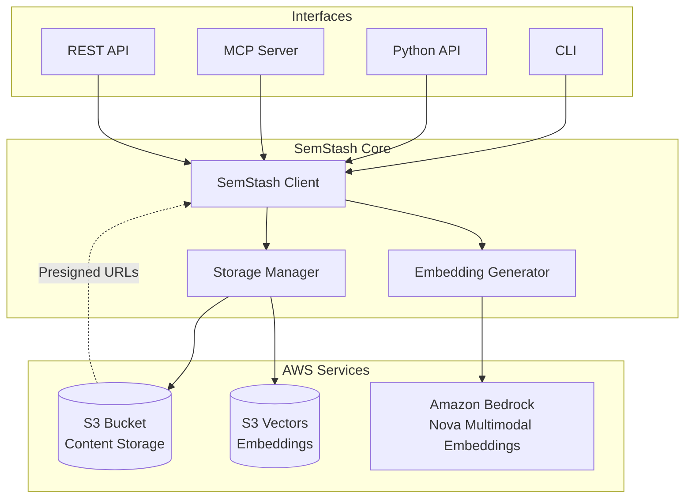
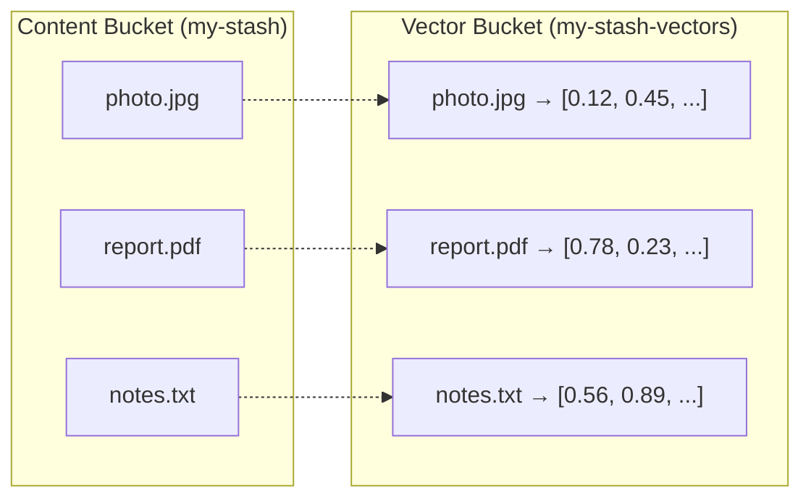

# SemStash

**Unlimited semantic storage for humans and AI agents.**

SemStash lets you store any content—text, images, audio, video, or documents—and find it using natural language. Instead of remembering exact file names or organizing folders, you simply describe what you're looking for: *"the presentation about Q3 revenue"* or *"photos from the beach trip"*.

Under the hood, SemStash combines three AWS services: [Amazon S3](https://aws.amazon.com/s3/) provides virtually unlimited, durable storage for your files. [Amazon S3 Vectors](https://aws.amazon.com/s3/features/vectors/) stores vector embeddings that capture the semantic meaning of your content. [Amazon Nova](https://aws.amazon.com/ai/generative-ai/nova/) generates these embeddings, understanding text, images, audio, and video in a unified way.

## How It Works

When you upload a file, SemStash stores it in S3 and generates a vector embedding using Amazon Nova. This embedding captures what the content *means*, not just what it *contains*. When you search, SemStash converts your query into an embedding and finds content with similar meaning.



This architecture means you can search across different media types. Upload a photo of a sunset, then find it by searching for *"evening sky with orange colors"*. Upload a meeting recording, then find it by asking for *"discussion about the new product launch"*.

## Installation

Install SemStash as a command-line tool using [uv](https://docs.astral.sh/uv/):

```bash
uv tool install git+https://github.com/danilop/semstash.git
```

Or add it to your Python project:

```bash
uv add git+https://github.com/danilop/semstash.git
pip install git+https://github.com/danilop/semstash.git  # alternatively
```

## Getting Started

Before using SemStash, you need AWS credentials configured (via environment variables, `~/.aws/credentials`, or an IAM role) with permissions for S3, S3 Vectors, and [Amazon Bedrock](https://aws.amazon.com/bedrock/).

### Creating Your First Stash

A "stash" is a semantic storage container. Create one by giving it a name:

```bash
semstash init my-stash
```

This creates an S3 bucket for your content and a vector index for embeddings. The stash is ready to use immediately.

### Uploading Content

Add files to your stash:

```bash
semstash my-stash upload vacation-photo.jpg
semstash my-stash upload quarterly-report.pdf
semstash my-stash upload meeting-notes.txt
```

You can upload multiple files at once and add tags for organization:

```bash
semstash my-stash upload *.jpg --tag photos --tag 2024
```

### Searching with Natural Language

Find content by describing what you're looking for:

```bash
semstash my-stash query "beach sunset"
semstash my-stash query "financial projections for next year"
semstash my-stash query "action items from last meeting"
```

Results are ranked by semantic similarity. You can filter by tags:

```bash
semstash my-stash query "sunset" --tag photos
```

### Managing Content

Browse what's in your stash:

```bash
semstash my-stash browse
semstash my-stash browse --prefix reports/
```

Get a download URL for specific content:

```bash
semstash my-stash get quarterly-report.pdf
```

Remove content you no longer need:

```bash
semstash my-stash delete old-draft.txt
```

## Python API

For programmatic access, import the `SemStash` class:

```python
from semstash import SemStash

# Create and initialize storage
stash = SemStash("my-stash")
stash.init()

# Upload content with tags
result = stash.upload("photo.jpg", tags=["vacation", "beach"])
print(f"Stored as: {result.key}")

# Query semantically
for item in stash.query("sunset on beach", top_k=5):
    print(f"{item.score:.2f} - {item.key}")
    print(f"  Download: {item.url}")

# Get content metadata and URL
content = stash.get("photo.jpg")
print(f"Type: {content.content_type}, Size: {content.file_size}")

# Download content locally
stash.download("photo.jpg", "./local-copy.jpg")

# Delete when done
stash.delete("photo.jpg")
```

The API supports all the same operations as the CLI: `init()`, `open()`, `upload()`, `query()`, `get()`, `download()`, `delete()`, `browse()`, `check()`, `sync()`, and `destroy()`.

## Architecture

SemStash uses a straightforward architecture that separates content storage from semantic indexing:



The core library handles all AWS interactions. Five interfaces—CLI, Python API, [Model Context Protocol](https://modelcontextprotocol.io/) (MCP) server, Web UI, and REST API—share this same core, ensuring consistent behavior across all access methods.

### Storage Design

Each stash consists of two S3 buckets: one for content files and one for vector embeddings. The content bucket stores your original files with their metadata. The vector bucket uses [S3 Vectors](https://aws.amazon.com/s3/features/vectors/) to store embeddings with the same keys, enabling fast similarity search.



This design keeps content and embeddings synchronized: when you delete a file, its embedding is also removed. The `check` command verifies consistency, and `sync` repairs any drift.

## Supported Content Types

SemStash handles multiple content categories through [Amazon Nova Multimodal Embeddings](https://docs.aws.amazon.com/nova/latest/userguide/modality-embeddings.html) via Amazon Bedrock:

**Text** files are embedded directly. This includes plain text (`.txt`), Markdown (`.md`), JSON, HTML, CSV, and XML. The embedding captures the semantic meaning of the text content.

**Images** are embedded visually. Supported formats include JPEG, PNG, GIF, and WebP. Nova understands the visual content, so you can search for *"red car"* or *"person smiling"* and find matching images.

**Audio** files are processed for semantic content. MP3, WAV, FLAC, and OGG formats are supported. You can search recordings by their spoken content or audio characteristics.

**Video** content is embedded considering both visual and audio elements. MP4, WebM, MOV, and MKV formats work. Search for *"presentation with charts"* or *"outdoor interview"*.

**Documents** receive special handling. PDF files are rendered as images and embedded visually, preserving layout and graphics. Word documents (`.docx`), PowerPoint presentations (`.pptx`), and Excel spreadsheets (`.xlsx`) have their text extracted and embedded, making all their content searchable.

## Use Cases

### Personal Knowledge Base

Store articles, notes, and research you want to remember. Instead of organizing bookmarks or maintaining folder hierarchies, upload content and search later by topic:

```bash
semstash knowledge upload interesting-article.pdf --tag research
semstash knowledge query "machine learning optimization techniques"
```

### Media Library

Manage photos, videos, and audio without manual tagging. Upload your media and search by what's in it:

```bash
semstash media upload vacation-photos/*.jpg
semstash media query "beach with palm trees"
semstash media query "people dancing"
```

### Document Archive

Keep business documents searchable without complex filing systems. Upload contracts, reports, and correspondence, then find them by content:

```bash
semstash archive upload contracts/*.pdf --tag legal
semstash archive query "non-compete clause"
semstash archive query "payment terms 90 days"
```

### AI Agent Memory

Give AI agents persistent, searchable memory. The MCP server integrates with any MCP-compatible assistant:

```bash
semstash mcp  # Start MCP server
```

Agents can upload information they learn and query it later, building knowledge over time.

## MCP Server

The [Model Context Protocol](https://modelcontextprotocol.io/) server lets AI assistants use SemStash as persistent memory. Start it with:

```bash
semstash mcp
```

For MCP-compatible assistants, add to your configuration:

```json
{
  "mcpServers": {
    "semstash": {
      "command": "semstash",
      "args": ["mcp"],
      "env": {
        "SEMSTASH_BUCKET": "my-agent-memory"
      }
    }
  }
}
```

The MCP server exposes tools for uploading content, querying semantically, browsing stored items, and managing the stash. Agents can save information they discover and retrieve it in future conversations.

## Web Interface

SemStash includes a browser-based interface for managing your semantic storage without using the command line. Start the server and open your browser:

```bash
semstash web
# Open http://localhost:8000/ui/
```

The web interface provides:

| Page | URL | Purpose |
|------|-----|---------|
| Dashboard | `/ui/` | Storage stats, quick actions |
| Upload | `/ui/upload` | Drag-and-drop file uploads with tags |
| Browse | `/ui/browse` | Paginated content list with filtering |
| Search | `/ui/search` | Semantic search with visual results |
| Content | `/ui/content/{key}` | Preview, metadata, download, delete |

## REST API

For web applications or services that need programmatic HTTP access, use the REST API:

```bash
semstash web
```

The API runs at `http://localhost:8000` with interactive documentation at `/docs`. Key endpoints:

```
POST /init          Create new storage
POST /open          Open existing storage
POST /upload        Upload files (multipart form)
GET  /query?q=...   Semantic search
GET  /content/{key} Get metadata and download URL
DELETE /content/{key} Remove content
GET  /browse        List stored content
GET  /stats         Storage statistics
GET  /check         Consistency check
POST /sync          Repair inconsistencies
DELETE /destroy     Remove storage (irreversible)
```

Configure the server with environment variables:

```bash
export SEMSTASH_BUCKET=my-stash
export SEMSTASH_HOST=0.0.0.0
export SEMSTASH_PORT=8000
semstash web
```

## Configuration

SemStash works with sensible defaults but supports customization through environment variables or a configuration file.

### Environment Variables

```bash
SEMSTASH_BUCKET=my-stash        # Default bucket name
SEMSTASH_REGION=us-east-1       # AWS region
SEMSTASH_DIMENSION=3072         # Embedding dimension (256, 384, 1024, 3072)
```

### Configuration File

Create `semstash.toml` or `.semstash.toml`:

```toml
[aws]
bucket = "my-stash"
region = "us-east-1"

[embeddings]
dimension = 3072

[output]
format = "table"  # or "json"
```

### Embedding Dimensions

Higher dimensions capture more semantic nuance but use more storage. The default (3072) works well for most cases. Lower dimensions (256, 384, 1024) reduce storage costs with some accuracy trade-off.

The dimension is set when you create a stash and cannot be changed afterward. When you open an existing stash, SemStash automatically uses its configured dimension.

## AWS Requirements

SemStash requires these AWS permissions:

**S3**: Create and manage buckets, upload and download objects, list contents.

**S3 Vectors**: Create vector indexes, store and query vectors.

**Bedrock**: Invoke the Nova embeddings model.

SemStash defaults to `us-east-1`. Check [AWS Capabilities by Region](https://builders.aws/capabilities) for current availability of Amazon Bedrock, Amazon S3, and Amazon S3 Vectors in your preferred region.

## Maintenance Commands

### Checking Consistency

Verify that content and embeddings are synchronized:

```bash
semstash my-stash check
```

This reports any orphaned embeddings (vectors without content) or missing embeddings (content without vectors).

### Synchronizing Storage

Repair any inconsistencies found by check:

```bash
semstash my-stash sync
```

This removes orphaned embeddings and regenerates missing ones.

### Storage Statistics

See what's in your stash:

```bash
semstash my-stash stats
```

### Destroying a Stash

Permanently remove a stash and all its content:

```bash
semstash my-stash destroy --force
```

This is irreversible. The `--force` flag is required when the stash contains data.

## Development

Clone the repository and install development dependencies:

```bash
git clone https://github.com/danilop/semstash.git
cd semstash
uv sync --all-extras
```

Run all checks (linting, formatting, type checking, tests):

```bash
make check       # Full check including mypy and AWS integration tests
make check-fast  # Quick check without mypy and AWS tests
```

Individual commands:

```bash
make test             # Unit tests (mocked AWS)
make test-integration # Integration tests (real AWS)
make lint             # Ruff linter
make format           # Code formatting
make mypy             # Type checking
```

### Testing Strategy

Unit tests mock all AWS services using [moto](https://github.com/getmoto/moto) for S3 and custom mocks for S3 Vectors and Bedrock. These run quickly without AWS credentials.

Integration tests use real AWS services. They create temporary resources, run tests, and clean up. Run them with:

```bash
uv run pytest --use-aws
```

### Pre-commit Hooks

Install hooks for automatic checking on commit:

```bash
make pre-commit-install
```

This runs linting, formatting, dead code detection, type checking, and tests before each commit.

## License

MIT License—see [LICENSE](LICENSE) for details.
